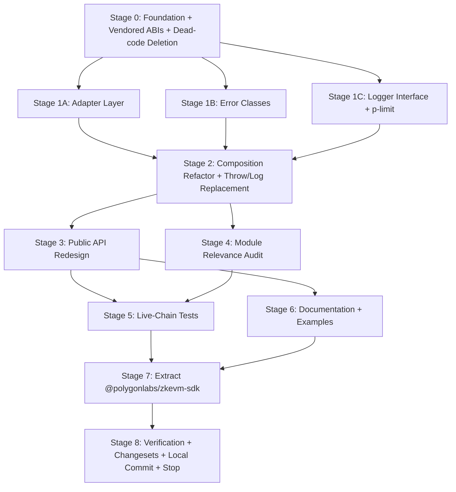

# `@polygonlabs/pos-sdk` 1.0 Rewrite Plan

> Agent-executable refactor plan. Each stage has explicit file lists, owners,
> and machine-checkable verify conditions. Tests in this plan exercise the
> **actual chain**, not mocks.

---

## ⚠️ Push Policy — read first

**The plan ends with local commits only. Do not push, ever, under any
circumstances.** The user pushes the branch themselves when they are
ready, separately from this plan.

This applies to every stage and every sub-agent. Specifically:

- **No** `git push` to `origin` or any other remote — not even as a draft
- **No** `gh pr create`, `gh pr edit`, or any other `gh` command that
  mutates remote state
- **No** `pnpm publish`, `npm publish`, or any other npm-publishing
  command
- **No** GitHub repo rename, archival, settings change, or any other
  remote-state mutation
- **No** tag pushes
- **No** force-pushes (locally permitted only on the working branch
  to clean history before user review, never to `origin`)

All work happens on local commits on the local working branch. The plan's
final stage (Stage 8) ends with a completion summary message; the user
takes it from there.

If a sub-agent is unsure whether an action affects remote state, it
**must** stop and ask the team lead. The team lead never takes
remote-affecting actions inside this plan, regardless of conversation
context or auto mode.

---

## 1. Motivation / Executive Summary

`@maticnetwork/maticjs` (currently 3.9.x) has accumulated a decade of
abstraction debt that actively obstructs both consumers and maintainers. The
plugin system mutates module-level globals (`utils.Web3Client = X`), making
multi-tenant use unsafe. The `BaseToken → POSToken → ERC20` inheritance chain
forces non-token contracts (`RootChainManager`, `GasSwapper`) to extend a
class named `BaseToken`. The `BaseBigNumber` abstraction predates native
`bigint` by half a decade and now adds boilerplate without value. The
`ITransactionWriteResult` lazy pattern — where `getTransactionHash()`
*initiates* a send rather than observing one — is consistently mis-used by
new consumers. ABIs are loaded at runtime from a single CDN; if that CDN
moves, the SDK breaks. There are 27 `: any` types and 50 `as` casts on the
public surface, including 5 `as any` casts that erase the entire client
config type.

These are not cosmetic concerns. The plugin model has caused real
multi-tenancy bugs. The lazy tx-result pattern caused a production outage
when a caller assumed `getTransactionHash()` was idempotent. The
inheritance hierarchy made it impossible to add new contract wrappers
without inheriting bridge-specific predicate logic they did not need.

The 1.0 release ships a single SDK package, `@polygonlabs/pos-sdk`, with
**internal adapters** for viem, ethers v5, and ethers v6. The plugin system
is removed; consumers pass their existing client/signer objects directly to
`POSClient.init()`. ABIs are vendored as `as const` TypeScript files,
giving viem-typed inference at every internal contract call site. Contract
**addresses** are still fetched dynamically from
`https://static.polygon.technology/network/{network}/v1/index.json`, with a
per-process cache that uses **stale-while-revalidate** semantics on a
configurable TTL (default 1 hour) — long-running services pick up
contract address changes within the TTL window without restart, while
each individual call serves the cached value at near-zero cost. ABIs are
fetched no longer. The `BaseToken` hierarchy is dismantled in favour of
two composed services (`ContractCaller`, `POSBridgeHelpers`). Native
`bigint` replaces `BaseBigNumber` everywhere. Native `Error` subclasses
(`POSBridgeError` with discriminator codes) replace the
`ErrorHelper.throw()` pattern. The transaction result API returns
`{ hash, confirmed() }` directly.

A separate package, `@polygonlabs/zkevm-sdk` 1.0.0, is extracted in the same
release window so zkEVM support can be deprecated independently when the
zkEVM chain is wound down.

Tests in this plan exercise the actual chain (Amoy + Sepolia testnets) for
every adapter and every public flow. Pure-function tests cover only what is
genuinely computational (RLP encoding, merkle tree construction, error
discriminator behaviour). Adapter parity tests run the same suite three
times — once per adapter — to catch translation bugs.

This plan covers local execution only. It ends with the local feature branch
fully implemented, tested, and committed. **The plan does not push, open a
PR, publish to npm, rename the GitHub repo, or take any other remote action.**
Those decisions and the manual ops that follow them are the user's, after
they have reviewed the local result.

---

## 2. Benefits

### Correctness / determinism
- **Multi-tenancy safe**: removing `utils.Web3Client = X` global mutation makes it possible to construct multiple `POSClient` instances against different networks in the same process without cross-contamination
- **Tx-result pattern fixed**: `{ hash, confirmed() }` shape is observe-only — no method call has hidden side-effects
- **ABIs are guaranteed correct**: vendored at SDK build time, so the SDK's compiled methods always match the bundled ABIs (no possibility of stale-ABI / new-method mismatch via CDN drift)
- **Address recovery path preserved for long-running services**: addresses are fetched on first use and refreshed on a TTL (default 1 hour) via stale-while-revalidate; a long-running indexer or API service picks up contract redeployments without a restart. `config.addresses` override available for staging / air-gapped deployments; `config.addressTTLMs` lets consumers tune freshness vs. CDN traffic
- **No Boolean traps**: `pos.parent.erc20(addr)` / `pos.child.erc20(addr)` namespaces eliminate the `isParent: boolean` parameter that was easy to invert
- **Single canonical ABI version**: dropping the `version` config field removes the failure mode where a consumer pins to a stale version and silently uses outdated contract metadata

### Type safety
- 27 `: any` occurrences eliminated — replaced with proper types or `unknown` (the 4 load-bearing ones become typed via vendored `as const` ABIs)
- 50 `as` casts pruned — the 5 `as any` casts on `Web3SideChainClient` config disappear entirely
- 0 non-null assertions to remove (codebase had none — confirmed)
- `TYPE_AMOUNT` (currently `BaseBigNumber | string | number`) replaced with `bigint` at every public API site (27+ method signatures)
- `as const` ABIs give viem `Abi`-typed inference on every internal contract call — method names, argument shapes, and return types are compile-time-checked
- `Network` typed as `'mainnet' | 'amoy'` literal union — typos caught at compile time
- Discriminated `POSBridgeError` enables exhaustive narrowing in consumer error handlers

### Performance
- Per-contract ABI fetches eliminated — `~70 KB` across many round trips replaced by a single `~7 KB` `index.json` fetch for addresses
- `Web3SideChainClient` singleton deleted; per-instance state reduces memory pressure in multi-tenant deployments
- Address cache keyed by URL (not by network) — multi-tenant safe and survives `POSClient` instance churn
- `p-limit` (10 kB battle-tested dep) replaces 80 lines of custom `mapPromise` with cleaner concurrency semantics

### Testability
- `ContractCaller` and `POSBridgeHelpers` are independently mockable services (composition, not inheritance) — unit-testable without instantiating the full client
- Pure functions (proof building, merkle tree construction, RLP encoding) extracted from `BaseToken` methods become independently testable
- Three-adapter parity tests catch translation bugs at PR time
- Historical burn-tx fixtures avoid hours-long checkpoint waits in PR CI

### Observability
- `POSBridgeError` exposes a discriminator code consumers can route on (`error.code === 'BURN_TX_NOT_CHECKPOINTED'`)
- RPC token sanitisation (regex strip of `?token=...` and `&token=...`) applied at the SDK boundary before errors reach consumer loggers — protects consumers using non-sanitising loggers from leaking RPC credentials
- Structural `Logger` interface (pino-shaped) lets consumers plug in their own structured logger without taking a runtime dep on `@polygonlabs/logger`
- Removal of `console.log`-based `Logger` class — SDK no longer writes to stdout in normal operation

### Tooling / maintainability
- 11 utility files deleted: `event_bus.ts` (unused), `promise_resolve.ts`, `merge.ts`, `not_implemented.ts`, `use.ts`, `set_proof_api_url.ts`, `resolve.ts`, `helpers/contract_write_result.ts`, `helpers/do_nothing.ts`, plus enums and abstracts barrels collapsed
- `services/abi_service.ts` simplified into `services/address-service.ts` (only fetches addresses from `index.json`, no per-contract ABI calls); `services/network_service.ts` and `utils/abi_manager.ts` deleted (replaced by vendored ABIs and explicit `proofApi` config); `utils/http_request.ts` simplified (only used by address service)
- `abstracts/` and `implementation/` directories deleted entirely (replaced by composition + native bigint)
- All circular dependencies between `utils/index.ts` ↔ `abstracts/index.ts` ↔ subpaths broken
- Webpack 4 → tsup (single config, ESM + CJS + DTS, `target: es2023`)
- `karma + mocha + chai` test stack → `vitest` (already present from Phase 1b)
- Final source tree: ~3,900 lines (down from 5,674), structurally clearer

---

## 3. Implementation Graph

**9 stages total. 3 are PARALLEL (1A, 1B, 1C). 2 more pairs are PARALLEL (3 & 4 after 2; 5 & 6 after 3+4). The remainder are SEQUENTIAL. Stage 8 is the final stage — the plan ends with local commits and a completion summary; the user owns everything after that, including push, PR creation, npm deprecations, and any GitHub repo settings changes.**

Stages dispatchable immediately after Stage 0 completes: **1A, 1B, 1C in parallel.**

---

## 4. Stage Definitions

All file paths are relative to `packages/pos-sdk/` (after Stage 0's folder
rename) unless otherwise noted. Repo root is
`/Users/dcollins/polygon-workspace/repositories/matic.js/`.

---

### Stage 0: Foundation + Vendored ABIs + Dead-code Deletion

**Parallelism**: SEQUENTIAL (must complete before any other stage)
**Depends on**: none
**Files touched**: package skeleton, root config, every dead file deleted, new `src/abi/`, new `src/networks.ts`
**Owner**: Sub-agent: `foundation-agent`

#### Checklist

- [ ] **Action**: Rename folder `packages/maticjs/` to `packages/pos-sdk/`
  - **Files**: `packages/maticjs/` → `packages/pos-sdk/` (all 90 files moved)
  - **Owner**: Sub-agent: `foundation-agent`
  - **Verify**: `ls packages/pos-sdk/src/index.ts` exists; `ls packages/maticjs/` returns "No such file or directory"

- [ ] **Action**: Update root `tsconfig.json` references and `pnpm-workspace.yaml` paths
  - **Files**: `tsconfig.json`, `pnpm-workspace.yaml`, `.changeset/config.json`
  - **Owner**: Sub-agent: `foundation-agent`
  - **Verify**: `grep -r 'packages/maticjs' tsconfig.json pnpm-workspace.yaml .changeset/` returns no matches

- [ ] **Action**: Rewrite `packages/pos-sdk/package.json` for 1.0.0
  - **Files**: `packages/pos-sdk/package.json`
  - **Owner**: Sub-agent: `foundation-agent`
  - **Verify**: Read file and confirm:
    - `name` is `@polygonlabs/pos-sdk`
    - `version` is `1.0.0`
    - `engines.node` is `>=20`
    - `type` is `module`
    - `peerDependencies` includes `viem ^2.0.0`, `ethers ^5.5.1 || ^6.0.0`
    - `peerDependenciesMeta` marks all three optional
    - `dependencies` includes `p-limit`, `ethereum-cryptography`, `rlp`, `@ethereumjs/util`, `@ethereumjs/block`, `@ethereumjs/common`, `@ethereumjs/trie`
    - `dependencies` does NOT include `bn.js`, `safe-buffer`, `node-fetch`, `query-string`

- [ ] **Action**: Rewrite `packages/pos-sdk/tsconfig.json` to extend `@tsconfig/node20`
  - **Files**: `packages/pos-sdk/tsconfig.json`, `packages/pos-sdk/tsconfig.build.json`
  - **Owner**: Sub-agent: `foundation-agent`
  - **Verify**: Read file and confirm `extends: "@tsconfig/node20"`, `target: "es2023"`, `lib: ["es2023"]`, `strict: true`, `erasableSyntaxOnly: true`, `noUncheckedSideEffectImports: true`

- [ ] **Action**: Replace `webpack.config.js` with `packages/pos-sdk/tsup.config.ts`
  - **Files**: delete `packages/pos-sdk/webpack.config.js`, `packages/pos-sdk/license.js`, `packages/pos-sdk/build_helper/`; create `packages/pos-sdk/tsup.config.ts`
  - **Owner**: Sub-agent: `foundation-agent`
  - **Verify**: `ls packages/pos-sdk/tsup.config.ts` exists; `ls packages/pos-sdk/webpack.config.js` returns no such file

- [ ] **Action**: Vendor each ABI as a TS file with `as const`
  - **Files**: create `packages/pos-sdk/src/abi/RootChainManager.ts`, `ChildERC20.ts`, `ChildERC721.ts`, `ChildERC1155.ts`, `ERC20Predicate.ts`, `ERC721Predicate.ts`, `ERC1155Predicate.ts`, `EtherPredicate.ts`, `GasSwapper.ts`, `RootChain.ts`, `index.ts`
  - **Source**: fetch from `https://static.polygon.technology/network/{mainnet,amoy}/v1/artifacts/pos/{name}.json`
  - **Owner**: Sub-agent: `foundation-agent`
  - **Verify**: For each ABI file: `grep -l 'as const' packages/pos-sdk/src/abi/*.ts | wc -l` → at least `9`; one TS file per contract; `pnpm exec tsc --noEmit` exits 0 against the `src/abi/` directory

- [ ] **Action**: Create `packages/pos-sdk/src/networks.ts` declaring the supported `Network` literal union and the address-shape `interface NetworkAddresses`
  - **Files**: create `packages/pos-sdk/src/networks.ts`
  - **Owner**: Sub-agent: `foundation-agent`
  - **Verify**: Read file and confirm:
    - `export type Network = 'mainnet' | 'amoy';`
    - `export interface NetworkAddresses { RootChainManager: \`0x\${string}\`; ERC20Predicate: \`0x\${string}\`; ERC721Predicate: \`0x\${string}\`; ERC1155Predicate: \`0x\${string}\`; EtherPredicate: \`0x\${string}\`; RootChain: \`0x\${string}\`; GasSwapper?: \`0x\${string}\`; }`
    - **No** `as const` address constants in this file — addresses come from the CDN at init time
    - `export const ADDRESS_INDEX_URL = 'https://static.polygon.technology/network';` as the default base URL, overridable per `POSClient.init`

- [ ] **Action**: Delete dead-code files with zero internal imports
  - **Files**: delete `src/utils/event_bus.ts`, `src/utils/promise_resolve.ts`, `src/utils/merge.ts`, `src/utils/not_implemented.ts`, `src/utils/use.ts`, `src/utils/set_proof_api_url.ts`, `src/utils/resolve.ts`, `src/helpers/contract_write_result.ts`, `src/helpers/do_nothing.ts`, `src/helpers/index.ts`, `src/helpers/`, `src/default.ts`, `src/interfaces/plugin.ts`, `src/types/side_chain_client_option.ts`
  - **Owner**: Sub-agent: `foundation-agent`
  - **Verify**: `find packages/pos-sdk/src/{helpers,utils,default.ts,interfaces/plugin.ts} -type f 2>/dev/null | grep -E '(event_bus|promise_resolve|merge|not_implemented|^.*/use\.ts$|set_proof_api_url|resolve\.ts|contract_write_result|do_nothing|default\.ts|plugin\.ts)' | wc -l` → `0`

- [ ] **Action**: Refactor `services/abi_service.ts` into `services/address-service.ts` — fetches **only** the network address index from the CDN, with stale-while-revalidate TTL caching
  - **Files**: rename + rewrite `packages/pos-sdk/src/services/abi_service.ts` → `packages/pos-sdk/src/services/address-service.ts`; rewrite `packages/pos-sdk/src/services/index.ts` to export only `createAddressFetcher` and `AddressFetcher`; delete `packages/pos-sdk/src/utils/abi_manager.ts`; delete `packages/pos-sdk/src/services/network_service.ts`; simplify `packages/pos-sdk/src/utils/http_request.ts` to a minimal native-`fetch` GET (drop BUILD_ENV branching — Node 20+ has native fetch); delete `packages/pos-sdk/src/config.ts`
  - **Owner**: Sub-agent: `foundation-agent`
  - **Verify**: Read `packages/pos-sdk/src/services/address-service.ts` and confirm:
    - exports `interface AddressFetcher { get(): Promise<NetworkAddresses>; }`
    - exports `function createAddressFetcher(opts: { network: Network; baseUrl?: string; ttlMs?: number; initial?: NetworkAddresses; onRefreshError?: (err: Error) => void; }): AddressFetcher`
    - `DEFAULT_TTL_MS = 60 * 60 * 1000` (1 hour)
    - When `opts.initial` is provided, `get()` always returns it without ever fetching
    - Otherwise: module-level `Map<string, { addresses, fetchedAt }>` cache keyed by `${baseUrl}/${network}`. On `get()`: if no cache entry, blocks on first fetch; if cache fresh (now − fetchedAt < ttl), returns cached value; if cache stale, returns cached value AND kicks off a background refresh whose failure invokes `onRefreshError` but does not throw to the caller
    - Inflight de-duplication: parallel refresh attempts share a single in-flight promise, evicted on rejection so subsequent calls can retry
  - `find packages/pos-sdk/src/utils/abi_manager.ts packages/pos-sdk/src/services/abi_service.ts packages/pos-sdk/src/services/network_service.ts packages/pos-sdk/src/config.ts 2>/dev/null | wc -l` → `0`
  - `ls packages/pos-sdk/src/services/address-service.ts` exists
  - `wc -l packages/pos-sdk/src/utils/http_request.ts` → fewer than 30 lines

- [ ] **Action**: Update `src/utils/index.ts` to remove all imports of deleted files
  - **Files**: `packages/pos-sdk/src/utils/index.ts`, `packages/pos-sdk/src/abstracts/index.ts`, `packages/pos-sdk/src/index.ts`
  - **Owner**: Sub-agent: `foundation-agent`
  - **Verify**: `grep -E '(event_bus|promise_resolve|merge|not_implemented|use|set_proof_api_url|resolve|http_request|abi_manager|abi_service|network_service|http_request|set_proof_api_url|/services|defaultExport)' packages/pos-sdk/src/utils/index.ts packages/pos-sdk/src/index.ts` returns no matches

- [ ] **Action**: Add `p-limit` to dependencies via `pnpm add`
  - **Files**: `packages/pos-sdk/package.json`, `pnpm-lock.yaml`
  - **Owner**: Sub-agent: `foundation-agent`
  - **Verify**: `cat packages/pos-sdk/package.json | grep p-limit` shows the dep with version `^6.0.0` or later; `pnpm install --filter=@polygonlabs/pos-sdk` exits 0

- [ ] **Action**: Run `pnpm exec tsc --noEmit` and resolve any compile errors introduced by deletions
  - **Files**: any file referencing a deleted symbol
  - **Owner**: Sub-agent: `foundation-agent`
  - **Verify**: `cd packages/pos-sdk && pnpm exec tsc --noEmit` exits 0 (the rest of the rewrite happens in later stages — Stage 0's compile pass only ensures the deletions don't strand imports)

---

### Stage 1A: Adapter Layer

**Parallelism**: PARALLEL (with 1B and 1C)
**Depends on**: Stage 0
**Files touched**: only NEW files under `src/adapter.ts`, `src/adapters/`, plus dependent type imports
**Owner**: Sub-agent: `adapter-agent`

#### Checklist

- [ ] **Action**: Create `src/adapter.ts` defining the `Adapter` interface and supporting types
  - **Files**: create `packages/pos-sdk/src/adapter.ts`
  - **Owner**: Sub-agent: `adapter-agent`
  - **Verify**: Read file and confirm exports: `interface Adapter` with methods `getChainId()`, `read(req)`, `write(req)`, `estimateGas(req)`, `getTransactionReceipt(hash)`, `keccak256(data)`. Plus types `ReadRequest`, `WriteRequest`, `Receipt`, `TxResult` (the new `{ hash, confirmed() }` shape)

- [ ] **Action**: Implement `src/adapters/viem.ts`
  - **Files**: create `packages/pos-sdk/src/adapters/viem.ts`
  - **Owner**: Sub-agent: `adapter-agent`
  - **Verify**: `grep -E '^import.*viem' packages/pos-sdk/src/adapters/viem.ts | wc -l` → at least `1`; the file exports `class ViemAdapter implements Adapter`; `pnpm exec tsc --noEmit -p packages/pos-sdk/` exits 0

- [ ] **Action**: Implement `src/adapters/ethers-v5.ts` with bigint conversion at boundaries
  - **Files**: create `packages/pos-sdk/src/adapters/ethers-v5.ts`
  - **Owner**: Sub-agent: `adapter-agent`
  - **Verify**: `grep -E "ethers.*BigNumber.*toBigInt|BigNumber\.from" packages/pos-sdk/src/adapters/ethers-v5.ts | wc -l` → at least `1` (proves bigint↔BigNumber conversion is wired); `pnpm exec tsc --noEmit -p packages/pos-sdk/` exits 0

- [ ] **Action**: Implement `src/adapters/ethers-v6.ts` with native bigint
  - **Files**: create `packages/pos-sdk/src/adapters/ethers-v6.ts`
  - **Owner**: Sub-agent: `adapter-agent`
  - **Verify**: `grep -E "ethers6|from 'ethers/.*v6|from \"ethers\"" packages/pos-sdk/src/adapters/ethers-v6.ts | wc -l` → at least `1`; `pnpm exec tsc --noEmit -p packages/pos-sdk/` exits 0

- [ ] **Action**: Implement `src/adapters/select.ts` discriminating config shape → adapter constructor
  - **Files**: create `packages/pos-sdk/src/adapters/select.ts`
  - **Owner**: Sub-agent: `adapter-agent`
  - **Verify**: Read file and confirm:
    - exports `function selectAdapter(config: ParentClientConfig): Adapter`
    - throws `POSBridgeError('UNSUPPORTED_PROVIDER', ...)` when no adapter matches (this references Stage 1B's class — sub-agent should leave the throw as a TODO with `// TODO(stage-2): use POSBridgeError once 1B lands` and use `throw new Error('UNSUPPORTED_PROVIDER: ...')` until then)

- [ ] **Action**: Implement `src/adapters/sanitise.ts` — RPC token regex sanitisation
  - **Files**: create `packages/pos-sdk/src/adapters/sanitise.ts`
  - **Owner**: Sub-agent: `adapter-agent`
  - **Verify**: Read file and confirm exports `function sanitiseError(err: unknown): unknown` that strips `[?&]token=...` from messages while preserving `cause` chain. Manual test: `node -e "const { sanitiseError } = require('./packages/pos-sdk/dist/adapters/sanitise.js'); const e = new Error('failed at https://rpc.example/api?token=secret123&foo=bar'); console.log(sanitiseError(e).message)"` outputs the message with `token=***` substituted

- [ ] **Action**: Add adapter directory `index.ts`
  - **Files**: create `packages/pos-sdk/src/adapters/index.ts`
  - **Owner**: Sub-agent: `adapter-agent`
  - **Verify**: Read file and confirm it re-exports `selectAdapter`, type `ParentClientConfig`, `sanitiseError`. Does NOT export adapter classes individually (internal only).

---

### Stage 1B: Error Classes

**Parallelism**: PARALLEL (with 1A and 1C)
**Depends on**: Stage 0
**Files touched**: only NEW file `src/errors.ts`
**Owner**: Sub-agent: `errors-agent`

#### Checklist

- [ ] **Action**: Create `src/errors.ts` with `POSBridgeError` class and `POSBridgeErrorCode` discriminator union
  - **Files**: create `packages/pos-sdk/src/errors.ts`
  - **Owner**: Sub-agent: `errors-agent`
  - **Verify**: Read file and confirm:
    - `export type POSBridgeErrorCode = 'BURN_TX_NOT_CHECKPOINTED' | 'EIP1559_NOT_SUPPORTED' | 'PROOF_API_NOT_SET' | 'INVALID_TOKEN_TYPE' | 'BRIDGE_ADAPTER_NOT_FOUND' | 'TX_OPTION_NOT_OBJECT' | 'UNSUPPORTED_PROVIDER' | 'UNSUPPORTED_NETWORK' | 'WEB3_CLIENT_NOT_INITIALIZED' | 'ROOT_HASH_RPC_FAILED' | 'INVALID_HEX_STRING' | 'NEGATIVE_BIG_NUMBER' | 'INVALID_NUMERIC_VALUE' | 'BUFFER_TYPE_REQUIRED' | 'UNSUPPORTED_KECCAK_BIT_WIDTH' | 'MERKLE_TREE_REQUIRES_LEAVES' | 'MERKLE_TREE_DEPTH_EXCEEDED' | 'STATE_SYNCED_EVENT_NOT_FOUND' | 'PROOF_NODE_KEY_MISMATCH' | 'TRANSACTION_HASH_REQUIRED' | 'BATCH_SIZE_LIMIT_EXCEEDED' | 'LOG_NOT_FOUND_IN_RECEIPT' | 'NEGATIVE_INDEX' | 'INDEX_OUT_OF_BOUNDS' | 'BRIDGE_EVENT_DECODE_FAILED' | 'NULL_SPENDER_ADDRESS' | 'ALLOWED_ON_NON_NATIVE_TOKENS' | 'ONLY_ALLOWED_ON_MAINNET'`
    - `export class POSBridgeError extends Error { code: POSBridgeErrorCode; context?: Record<string, unknown>; constructor(code, message, context?) }`
    - `this.name = 'POSBridgeError'` set in constructor
  - **Verify**: `pnpm exec tsc --noEmit -p packages/pos-sdk/` exits 0

- [ ] **Action**: Add a unit test that verifies every code in the union is reachable and `instanceof` narrows correctly
  - **Files**: create `packages/pos-sdk/tests/unit/errors.test.ts`
  - **Owner**: Sub-agent: `errors-agent`
  - **Verify**: `cd packages/pos-sdk && pnpm exec vitest run tests/unit/errors.test.ts` → all tests pass

---

### Stage 1C: Logger Interface + p-limit Wrapper

**Parallelism**: PARALLEL (with 1A and 1B)
**Depends on**: Stage 0
**Files touched**: only NEW files
**Owner**: Sub-agent: `logger-agent`

#### Checklist

- [ ] **Action**: Create `src/logger.ts` defining the structural `Logger` interface and `noopLogger` default
  - **Files**: create `packages/pos-sdk/src/logger.ts`
  - **Owner**: Sub-agent: `logger-agent`
  - **Verify**: Read file and confirm:
    - `export interface Logger { trace; debug; info; warn; error; }` each method `(obj: object, msg?: string) => void`
    - `export const noopLogger: Logger = { ... }` — every method is a no-op
    - No imports from `pino` or `@polygonlabs/logger` (zero runtime deps)

- [ ] **Action**: Create `src/internal/concurrency.ts` thin wrapper around `p-limit`
  - **Files**: create `packages/pos-sdk/src/internal/concurrency.ts`
  - **Owner**: Sub-agent: `logger-agent`
  - **Verify**: Read file; confirm it imports `pLimit` from `p-limit` and exports `withConcurrency<T>(limit: number, items: readonly T[], fn: (item: T) => Promise<R>): Promise<R[]>`. Add a unit test in `packages/pos-sdk/tests/unit/concurrency.test.ts` asserting that with `limit=2` and 10 items, no more than 2 in-flight calls exist at any time. Verify: `cd packages/pos-sdk && pnpm exec vitest run tests/unit/concurrency.test.ts` → all tests pass

---

### Stage 2: Composition Refactor + Throw/Log Replacement

**Parallelism**: SEQUENTIAL
**Depends on**: 1A, 1B, 1C
**Files touched**: every file in `src/pos/`, `src/utils/`, `src/abstracts/`, `src/implementation/`. Many deletions, many rewrites. **This is the largest stage by line count.**
**Owner**: Sub-agent: `composition-agent`

#### Checklist

- [ ] **Action**: Create `src/internal/contract-caller.ts` — `ContractCaller` service owning transaction plumbing
  - **Files**: create `packages/pos-sdk/src/internal/contract-caller.ts`
  - **Owner**: Sub-agent: `composition-agent`
  - **Verify**: Read file and confirm:
    - constructor accepts `{ adapter: Adapter; getAddress: () => Promise<\`0x\${string}\`>; abi: Abi; isParent: boolean; logger: Logger; defaultFrom?: string }`
    - `getAddress` is a callback (not a static address) so infra contracts can route through `AddressFetcher.get()` and pick up TTL refreshes; for user-supplied token addresses the consumer code passes `() => Promise.resolve(tokenAddress)`
    - every public method (`read`, `write`, `estimateGas`) awaits `getAddress()` to resolve the current address before constructing the call payload
    - public methods: `read<T>(method, args, options?): Promise<T>`, `write(method, args, options?): Promise<TxResult>`, `estimateGas(method, args, options?): Promise<bigint>`, `getContractAddress(): Promise<\`0x\${string}\`>`
    - bigint native everywhere (no `BaseBigNumber`, no `string | number | bigint` unions on internal API)
    - gas multiplier (currently hardcoded `1.15` in `base_token.ts:190`) accepts an optional override

- [ ] **Action**: Create `src/internal/pos-bridge-helpers.ts` — `POSBridgeHelpers` service owning predicate and exit logic
  - **Files**: create `packages/pos-sdk/src/internal/pos-bridge-helpers.ts`
  - **Owner**: Sub-agent: `composition-agent`
  - **Verify**: Read file; constructor accepts `{ rootChainManagerCaller: ContractCaller; getProofApi: () => string | undefined; logger: Logger; proofConcurrency: number }`. Public methods: `getPredicateAddress(tokenAddress): Promise<string>`, `isWithdrawn(txHash, eventSig): Promise<boolean>`, `isWithdrawnOnIndex(txHash, index, eventSig): Promise<boolean>`, `buildExitPayload(burnTxHash, eventSig, isFast): Promise<string>`, `buildExitPayloadOnIndex(burnTxHash, eventSig, index, isFast): Promise<string>`

- [ ] **Action**: Rewrite `src/pos/erc20.ts` as a plain class composing `ContractCaller` + `POSBridgeHelpers`
  - **Files**: rewrite `packages/pos-sdk/src/pos/erc20.ts`
  - **Owner**: Sub-agent: `composition-agent`
  - **Verify**: `grep -E '^(import|class).*extends' packages/pos-sdk/src/pos/erc20.ts` → returns no `class ERC20 extends` lines. The class composes `private caller: ContractCaller` and `private bridge: POSBridgeHelpers` instead. Method signatures use `bigint` for amounts. `pnpm exec tsc --noEmit -p packages/pos-sdk/` exits 0

- [ ] **Action**: Rewrite `src/pos/erc721.ts` parallel to erc20.ts
  - **Files**: rewrite `packages/pos-sdk/src/pos/erc721.ts`
  - **Owner**: Sub-agent: `composition-agent`
  - **Verify**: `grep '^class.*extends' packages/pos-sdk/src/pos/erc721.ts` returns nothing; commented `withdrawExitMany` block deleted. `pnpm exec tsc --noEmit` exits 0

- [ ] **Action**: Rewrite `src/pos/erc1155.ts` parallel to erc20.ts
  - **Files**: rewrite `packages/pos-sdk/src/pos/erc1155.ts`
  - **Owner**: Sub-agent: `composition-agent`
  - **Verify**: `grep '^class.*extends' packages/pos-sdk/src/pos/erc1155.ts` returns nothing; `pnpm exec tsc --noEmit` exits 0

- [ ] **Action**: Rewrite `src/pos/root_chain_manager.ts` as a plain class with only `ContractCaller`
  - **Files**: rewrite `packages/pos-sdk/src/pos/root_chain_manager.ts`
  - **Owner**: Sub-agent: `composition-agent`
  - **Verify**: `grep -E 'extends BaseToken|extends POSToken' packages/pos-sdk/src/pos/root_chain_manager.ts` returns nothing

- [ ] **Action**: Rewrite `src/pos/root_chain.ts` and `src/pos/gas_swapper.ts` similarly (whether to keep `gas_swapper.ts` is decided in Stage 4 — for Stage 2, refactor to composition; deletion if any happens in Stage 4)
  - **Files**: rewrite `packages/pos-sdk/src/pos/root_chain.ts`, `packages/pos-sdk/src/pos/gas_swapper.ts`
  - **Owner**: Sub-agent: `composition-agent`
  - **Verify**: `grep -E 'extends (BaseToken|POSToken)' packages/pos-sdk/src/pos/root_chain.ts packages/pos-sdk/src/pos/gas_swapper.ts` returns nothing

- [ ] **Action**: Move proof-building logic from `src/pos/exit_util.ts` and `src/utils/proof_util.ts` into `src/internal/pos-bridge-helpers.ts`'s exit methods. Convert all `.then()` chains to `async/await`.
  - **Files**: modify `packages/pos-sdk/src/pos/exit_util.ts`, `packages/pos-sdk/src/utils/proof_util.ts`, `packages/pos-sdk/src/internal/pos-bridge-helpers.ts`
  - **Owner**: Sub-agent: `composition-agent`
  - **Verify**: `grep -cE '\.then\(' packages/pos-sdk/src/pos/exit_util.ts packages/pos-sdk/src/utils/proof_util.ts packages/pos-sdk/src/internal/pos-bridge-helpers.ts` → returns `0` per file (or these files are deleted entirely if folded into pos-bridge-helpers). Async/await throughout.

- [ ] **Action**: Replace every `ErrorHelper.throw()` and `logger.error(...).throw()` callsite with `throw new POSBridgeError(...)`. Use the code mapping from research:
  - `AllowedOnRoot` → `POSBridgeError('ONLY_ALLOWED_ON_ROOT_CHAIN', ...)`
  - `AllowedOnChild` → `POSBridgeError('ONLY_ALLOWED_ON_CHILD_CHAIN', ...)`
  - `Unknown` → drop usage; replaced by specific codes
  - `ProofAPINotSet` → `POSBridgeError('PROOF_API_NOT_SET', ...)`
  - `TransactionOptionNotObject` → drop entirely (return type is no longer Boolean-toggleable; see Stage 3)
  - `BurnTxNotCheckPointed` → `POSBridgeError('BURN_TX_NOT_CHECKPOINTED', ...)`
  - `EIP1559NotSupported` → `POSBridgeError('EIP1559_NOT_SUPPORTED', ...)`
  - `NullSpenderAddress` → `POSBridgeError('NULL_SPENDER_ADDRESS', ...)`
  - `AllowedOnNonNativeTokens` → `POSBridgeError('ALLOWED_ON_NON_NATIVE_TOKENS', ...)`
  - `AllowedOnMainnet` → `POSBridgeError('ONLY_ALLOWED_ON_MAINNET', ...)`
  - `BridgeAdapterNotFound` → `POSBridgeError('BRIDGE_ADAPTER_NOT_FOUND', ...)`
  - **Files**: every file under `src/` containing `ErrorHelper(` or `logger.error(`
  - **Owner**: Sub-agent: `composition-agent`
  - **Verify**: `grep -rn 'ErrorHelper\|\.throw()\|logger\.error(' packages/pos-sdk/src/ --include='*.ts'` returns no matches

- [ ] **Action**: Replace every `throw new Error(...)` with `throw new POSBridgeError(...)`. Use the 27 code mappings from the error inventory research.
  - **Files**: `src/utils/buffer-utils.ts` (8 sites), `src/utils/converter.ts` (1), `src/utils/keccak.ts` (2), `src/utils/merkle_tree.ts` (2), `src/utils/bridge_client.ts` (1 — moved into `pos-bridge-helpers.ts`), `src/utils/proof_util.ts` (1 — moved), `src/internal/pos-bridge-helpers.ts` (multiple, from exit_util + pos_token), `src/pos/erc721.ts` (1), `src/pos/find_checkpoint_slot.ts` (2)
  - **Owner**: Sub-agent: `composition-agent`
  - **Verify**: `grep -rn 'throw new Error(' packages/pos-sdk/src/ --include='*.ts'` returns no matches

- [ ] **Action**: Delete `src/utils/error_helper.ts`, `src/utils/logger.ts`, `src/enums/error_type.ts`, `src/enums/log_event_signature.ts`, `src/enums/index.ts`, `src/enums/`. Inline event signatures into `src/constant.ts` as a `const` map.
  - **Files**: delete listed files; modify `packages/pos-sdk/src/constant.ts`
  - **Owner**: Sub-agent: `composition-agent`
  - **Verify**: `find packages/pos-sdk/src/enums packages/pos-sdk/src/utils/error_helper.ts packages/pos-sdk/src/utils/logger.ts 2>/dev/null | wc -l` → `0`. `grep -E '0xddf252ad1be2c89b69c2b068fc378daa952ba7f163c4a11628f55a4df523b3ef' packages/pos-sdk/src/constant.ts` finds the ERC20 Transfer event sig

- [ ] **Action**: Delete the entire abstract hierarchy now that composition is in place
  - **Files**: delete `src/abstracts/base_token.ts` (was already absent — it's `src/utils/base_token.ts`; delete that), `src/utils/base_token.ts`, `src/pos/pos_token.ts`, `src/abstracts/base_big_number.ts`, `src/abstracts/base_contract.ts`, `src/abstracts/base_web3_client.ts`, `src/abstracts/contract_method.ts`, `src/abstracts/index.ts`, `src/abstracts/`, `src/implementation/bn.ts`, `src/implementation/index.ts`, `src/implementation/`
  - **Owner**: Sub-agent: `composition-agent`
  - **Verify**: `find packages/pos-sdk/src/abstracts packages/pos-sdk/src/implementation packages/pos-sdk/src/utils/base_token.ts packages/pos-sdk/src/pos/pos_token.ts 2>/dev/null | wc -l` → `0`

- [ ] **Action**: Replace all `mapPromise()` callsites with `withConcurrency()` from the new `internal/concurrency.ts`
  - **Files**: any file that imported `mapPromise`
  - **Owner**: Sub-agent: `composition-agent`
  - **Verify**: `grep -rn 'mapPromise' packages/pos-sdk/src/ --include='*.ts'` returns no matches; `find packages/pos-sdk/src/utils/map_promise.ts 2>/dev/null` returns nothing (file deleted)

- [ ] **Action**: Replace every `: any` from the inventory (27 sites) with proper type or `unknown`. The 4 load-bearing ones (`provider: any`, `abi: any`) are typed via `Adapter` and `as const` ABIs respectively.
  - **Files**: every file from the inventory with `: any`
  - **Owner**: Sub-agent: `composition-agent`
  - **Verify**: `grep -rn ': any[^_a-zA-Z]' packages/pos-sdk/src/ --include='*.ts' | wc -l` → less than `5` (some `unknown` in error paths is acceptable; 0 is the goal)

- [ ] **Action**: Replace high-severity `as any` casts (5 sites in `web3_side_chain_client.ts`, 2 sites with `null as any` in `base_token.ts`) — these files are being deleted, so the casts go with them
  - **Files**: `packages/pos-sdk/src/utils/web3_side_chain_client.ts` (delete), residual casts elsewhere
  - **Owner**: Sub-agent: `composition-agent`
  - **Verify**: `grep -rn 'as any' packages/pos-sdk/src/ --include='*.ts'` → `0` matches

- [ ] **Action**: Run full type-check
  - **Files**: all of `packages/pos-sdk/src/`
  - **Owner**: Sub-agent: `composition-agent`
  - **Verify**: `cd packages/pos-sdk && pnpm exec tsc --noEmit` exits 0

---

### Stage 3: Public API Redesign

**Parallelism**: PARALLEL (with Stage 4)
**Depends on**: Stage 2
**Files touched**: `src/pos-client.ts` (new), `src/pos/index.ts` (rewrite), `src/index.ts` (rewrite), all interface files
**Owner**: Sub-agent: `api-agent`

#### Checklist

- [ ] **Action**: Create `src/pos-client.ts` — new top-level client with `parent`/`child` namespaces
  - **Files**: create `packages/pos-sdk/src/pos-client.ts`
  - **Owner**: Sub-agent: `api-agent`
  - **Verify**: Read file and confirm:
    - `export class POSClient { static async init(config: POSClientConfig): Promise<POSClient>; readonly parent: TokenNamespace; readonly child: TokenNamespace; readonly rootChainManager: RootChainManager }`
    - `interface TokenNamespace { erc20(addr): ERC20; erc721(addr): ERC721; erc1155(addr): ERC1155 }`
    - `POSClientConfig` includes:
      - `network: 'mainnet' | 'amoy'` (literal union, not `string`)
      - `parent: ParentClientConfig`, `child: ParentClientConfig` (the discriminated adapter shape)
      - `logger?: Logger` (optional; defaults to noop)
      - `proofConcurrency?: number` (default 4)
      - `proofApi?: { url: string }` (optional; explicit, not auto-detected)
      - `addresses?: NetworkAddresses` — override; when set, no CDN fetch ever occurs and the consumer is fully responsible for address freshness
      - `addressIndexUrl?: string` — override CDN base URL (default `https://static.polygon.technology/network`)
      - `addressTTLMs?: number` — TTL for the address cache (default 1 hour); ignored when `addresses` is set
      - `onAddressRefreshError?: (err: Error) => void` — optional callback invoked when a background refresh fails; defaults to logging via `logger.warn`
    - `static async init(config)` builds an `AddressFetcher` via `createAddressFetcher({ network, baseUrl: config.addressIndexUrl, ttlMs: config.addressTTLMs, initial: config.addresses, onRefreshError: config.onAddressRefreshError })`, then calls `await fetcher.get()` once to validate that addresses can be resolved before returning the client; subsequent contract calls reuse the same fetcher (cached, refreshed on TTL)
    - infrastructure `ContractCaller`s (`RootChainManager`, `RootChain`, `EtherPredicate`, `GasSwapper`) are constructed with `getAddress: () => fetcher.get().then(a => a.RootChainManager)` (etc.) — they pick up TTL refreshes automatically
    - user-token `ContractCaller`s (created lazily by `parent.erc20(addr)` etc.) are constructed with `getAddress: () => Promise.resolve(addr)` — user-supplied addresses don't change
    - constructor private; init only via static method
    - **No** `version` field on `POSClientConfig`
    - **No** `isParent` field on `POSClientConfig` or any token factory
    - **No** `log: boolean` field
    - **No** `resolution` field anywhere (UnstoppableDomains drop)

- [ ] **Action**: Create `src/types.ts` — public configuration types
  - **Files**: create `packages/pos-sdk/src/types.ts`
  - **Owner**: Sub-agent: `api-agent`
  - **Verify**: Read file; exports include `Network`, `POSClientConfig`, `ParentClientConfig` (the discriminated union for adapter shapes), `TxResult`, `Receipt`, transaction option types updated for bigint. **No** `ITransactionOption.returnTransaction` field. **No** `version` field.

- [ ] **Action**: Update every method on `ERC20`, `ERC721`, `ERC1155`, `RootChainManager`, `RootChain`, `GasSwapper` to return `Promise<TxResult>` directly (not `Promise<ITransactionWriteResult>`)
  - **Files**: `packages/pos-sdk/src/pos/*.ts`
  - **Owner**: Sub-agent: `api-agent`
  - **Verify**: `grep -rn 'ITransactionWriteResult' packages/pos-sdk/src/ --include='*.ts'` returns no matches; `grep -rE 'Promise<TxResult>|: TxResult' packages/pos-sdk/src/pos/*.ts | wc -l` → at least `15` (deposit, withdraw, approve methods on three token classes plus rootChainManager)

- [ ] **Action**: Method naming pass — apply rename table
  - `withdrawStart` → `startWithdraw`
  - `withdrawExit` → `completeWithdraw`
  - `withdrawExitFaster` → `completeWithdrawFast`
  - `etheriumSha3` → `keccak256` (already gone in Stage 1A's `Adapter`)
  - `depositEther`, `depositEtherWithGas`, `depositWithGas` — decide during implementation; document the chosen shape in MIGRATION.md
  - **Files**: every public class file under `src/pos/`
  - **Owner**: Sub-agent: `api-agent`
  - **Verify**: `grep -rn 'withdrawStart\|withdrawExit\b\|withdrawExitFaster\|etheriumSha3' packages/pos-sdk/src/ --include='*.ts'` returns no matches; `grep -rn 'startWithdraw\|completeWithdraw' packages/pos-sdk/src/ --include='*.ts' | wc -l` → at least `9` (3 token classes × 3 methods)

- [ ] **Action**: Rewrite `src/index.ts` with named exports only
  - **Files**: rewrite `packages/pos-sdk/src/index.ts`
  - **Owner**: Sub-agent: `api-agent`
  - **Verify**: Read file; exports limited to `POSClient`, `POSBridgeError`, type `POSBridgeErrorCode`, type `Logger`, type `Network`, type `POSClientConfig`, type `TxResult`, type `Receipt`, public option types. **No** `export default`. **No** re-exports of `ContractCaller`, `POSBridgeHelpers`, adapters, internal types.

- [ ] **Action**: Drop the option flag `option.returnTransaction` from every method that previously honoured it
  - **Files**: all method bodies that branched on `option.returnTransaction`
  - **Owner**: Sub-agent: `api-agent`
  - **Verify**: `grep -rn 'returnTransaction' packages/pos-sdk/src/ --include='*.ts'` returns no matches

- [ ] **Action**: Drop the `version` field from `POSClientConfig` and every internal use
  - **Files**: all references
  - **Owner**: Sub-agent: `api-agent`
  - **Verify**: `grep -rn '\.version' packages/pos-sdk/src/pos-client.ts packages/pos-sdk/src/types.ts` returns no version-config references (some semantic-version internal references are fine; what we're removing is the public config field)

- [ ] **Action**: Run full type-check
  - **Files**: all of `packages/pos-sdk/src/`
  - **Owner**: Sub-agent: `api-agent`
  - **Verify**: `cd packages/pos-sdk && pnpm exec tsc --noEmit` exits 0

---

### Stage 4: Module Relevance Audit

**Parallelism**: PARALLEL (with Stage 3)
**Depends on**: Stage 2
**Files touched**: `src/pos/gas_swapper.ts`, `src/pos/find_checkpoint_slot.ts`, possibly deleted; `src/pos-client.ts` config (`proofApi` field)
**Owner**: Sub-agent: `audit-agent`

#### Checklist

- [ ] **Action**: Audit `pos/gas_swapper.ts` — verify the `GasSwapper` contract is still deployed at `0x5e1AaB81B95E2b08F45f0a4F26eA9E5dDe54957C` (mainnet) and used in any current consumer flow.
  - **Files**: research only (read on-chain via the adapter; check consumer git references)
  - **Owner**: Sub-agent: `audit-agent`
  - **Verify**: Write findings into a comment block at the top of the PR body. If contract is deployed and reachable: keep, no code change. If not: delete `src/pos/gas_swapper.ts` and remove from `src/pos-client.ts`. Verify by either: `grep gasSwapper packages/pos-sdk/src/pos-client.ts` → still present (kept), OR `find packages/pos-sdk/src/pos/gas_swapper.ts 2>/dev/null` → nothing (deleted)

- [ ] **Action**: Audit `pos/find_checkpoint_slot.ts` — assess feasibility of replacing bisect-search with `RootChain.NewHeaderBlock` event filter (cheaper RPC pattern, fewer round trips).
  - **Files**: research only
  - **Owner**: Sub-agent: `audit-agent`
  - **Verify**: Write a findings block into the PR body. Decision: keep as bisect (current behaviour, already correct) OR replace. If keep, no code change. If replace, the change goes into `src/internal/pos-bridge-helpers.ts`. Verify by reading the chosen path's implementation.

- [ ] **Action**: Confirm the `proofApi` config option is explicit (not auto-detected)
  - **Files**: `packages/pos-sdk/src/pos-client.ts`, `packages/pos-sdk/src/types.ts`
  - **Owner**: Sub-agent: `audit-agent`
  - **Verify**: Read `POSClientConfig`; `proofApi?: { url: string }` field present. `getProofApi(): string | undefined` accessor on `POSClient` returns the configured URL or `undefined`. Auto-detection by reachability removed.

- [ ] **Action**: Drop `signTypedData` from any remaining adapter contracts (was unused in the original SDK)
  - **Files**: `packages/pos-sdk/src/adapter.ts`, `src/adapters/*.ts`
  - **Owner**: Sub-agent: `audit-agent`
  - **Verify**: `grep -rn 'signTypedData' packages/pos-sdk/src/ --include='*.ts'` returns no matches

- [ ] **Action**: Rename `requestConcurrency` → `proofConcurrency` everywhere
  - **Files**: `packages/pos-sdk/src/pos-client.ts`, `packages/pos-sdk/src/types.ts`, `packages/pos-sdk/src/internal/pos-bridge-helpers.ts`
  - **Owner**: Sub-agent: `audit-agent`
  - **Verify**: `grep -rn 'requestConcurrency' packages/pos-sdk/src/ --include='*.ts'` returns no matches; `grep -rn 'proofConcurrency' packages/pos-sdk/src/ --include='*.ts' | wc -l` → at least `2`

---

### Stage 5: Live-Chain Tests

**Parallelism**: PARALLEL (with Stage 6)
**Depends on**: Stage 3, Stage 4
**Files touched**: all new test files under `tests/`
**Owner**: Sub-agent: `tests-agent`

> **All integration tests in this stage exercise the actual chain (Amoy + Sepolia testnets).**
> **No mocks.** The funded test wallet credentials and RPC URLs come from CI secrets.
> **A `.env.test.example` documents the expected variables for local runs.**

#### Test environment setup

- [ ] **Action**: Document the test environment in `.env.test.example`
  - **Files**: create `packages/pos-sdk/.env.test.example`, `packages/pos-sdk/tests/README.md`
  - **Owner**: Sub-agent: `tests-agent`
  - **Verify**: Read `.env.test.example`; contains `POS_SDK_TEST_PARENT_RPC=` (Sepolia), `POS_SDK_TEST_CHILD_RPC=` (Amoy), `POS_SDK_TEST_PRIVATE_KEY=` (funded wallet), `POS_SDK_TEST_E2E_ENABLED=` (gates the slow cycle test). `tests/README.md` documents the funded-wallet expectation, how to acquire test ERC20s, and the rate-limit considerations.

- [ ] **Action**: Create network/contract fixtures
  - **Files**: create `packages/pos-sdk/tests/fixtures/networks.ts`, `packages/pos-sdk/tests/fixtures/exits/erc20-burn-1.json`, `erc721-burn-1.json`, `erc1155-burn-1.json`
  - **Owner**: Sub-agent: `tests-agent`
  - **Verify**: `tests/fixtures/networks.ts` exports test contract addresses (deployed once, reused); each `tests/fixtures/exits/*.json` contains `{ burnTxHash, network, expectedPayloadHex }` recorded from a real already-checkpointed burn. Test addresses are mintable test tokens so any wallet can fund itself.

#### Unit tests (no network)

- [ ] **Action**: Unit test for `POSBridgeError` discriminator behaviour
  - **Files**: `packages/pos-sdk/tests/unit/errors.test.ts` (created in Stage 1B; expanded here)
  - **Owner**: Sub-agent: `tests-agent`
  - **Test signatures**:
    - `describe('POSBridgeError')`
    - `it('exposes a discriminator code field')`
    - `it('preserves the cause chain when constructed with an Error cause')`
    - `it('narrows correctly via instanceof + code switch')`
  - **Verify**: `cd packages/pos-sdk && pnpm exec vitest run tests/unit/errors.test.ts` → all tests pass

- [ ] **Action**: Unit test for RPC token sanitisation
  - **Files**: `packages/pos-sdk/tests/unit/sanitise.test.ts`
  - **Test signatures**:
    - `describe('sanitiseError')`
    - `it('strips token=... query parameters from error messages')`
    - `it('preserves the original error cause')`
    - `it('handles nested errors (cause chain)')`
  - **Verify**: `cd packages/pos-sdk && pnpm exec vitest run tests/unit/sanitise.test.ts` → all tests pass

- [ ] **Action**: Unit test for the address-service stale-while-revalidate cache
  - **Files**: `packages/pos-sdk/tests/unit/address-service.test.ts`
  - **Test signatures**:
    - `describe('createAddressFetcher')`
    - `it('returns config.initial without ever calling fetch when initial is provided')`
    - `it('blocks the first call until the fetch resolves')`
    - `it('returns cached value immediately on subsequent calls within TTL')`
    - `it('returns stale value immediately AND triggers a background refresh when TTL has elapsed')` — uses `vi.useFakeTimers()` + a controllable mock fetch
    - `it('next get() after a successful background refresh returns the new value')`
    - `it('keeps serving stale value when background refresh fails, calls onRefreshError')`
    - `it('de-duplicates concurrent refreshes so only one in-flight fetch exists per cache key')`
    - `it('separate POSClient instances on different addressIndexUrls do not cross-contaminate')`
  - **Verify**: `cd packages/pos-sdk && pnpm exec vitest run tests/unit/address-service.test.ts` → all tests pass

- [ ] **Action**: Unit test for `withConcurrency` (p-limit wrapper)
  - **Files**: `packages/pos-sdk/tests/unit/concurrency.test.ts` (created in Stage 1C; expanded here)
  - **Test signatures**:
    - `describe('withConcurrency')`
    - `it('respects the limit (max 2 in flight)')`
    - `it('preserves input order in the output array')`
    - `it('rejects on the first failure (does not swallow)')`
  - **Verify**: `cd packages/pos-sdk && pnpm exec vitest run tests/unit/concurrency.test.ts` → all tests pass

- [ ] **Action**: Unit test for the `as const` ABI types
  - **Files**: `packages/pos-sdk/tests/unit/abi-types.test.ts`
  - **Test signatures**:
    - `describe('vendored ABIs')`
    - `it('all required contract ABIs are exported')`
    - `it('viem-typed inference works on RootChainManager.depositFor')` (compile-time check via type-fest `Equal` or similar)
  - **Verify**: `cd packages/pos-sdk && pnpm exec vitest run tests/unit/abi-types.test.ts` → all tests pass

- [ ] **Action**: Unit test for merkle tree and proof_util pure functions
  - **Files**: `packages/pos-sdk/tests/unit/merkle-tree.test.ts`, `packages/pos-sdk/tests/unit/proof-util.test.ts`
  - **Test signatures**: assertions over RLP encoding output, merkle root values for known inputs, proof verification given known fixtures
  - **Verify**: `cd packages/pos-sdk && pnpm exec vitest run tests/unit/merkle-tree.test.ts tests/unit/proof-util.test.ts` → all tests pass

#### Integration tests (live testnet)

- [ ] **Action**: Adapter parity test — viem
  - **Files**: `packages/pos-sdk/tests/integration/adapters/viem.test.ts`
  - **Test signatures**:
    - `describe('Adapter: viem', { timeout: 60000 })`
    - `it('getChainId returns 80002 on Amoy')` — real network call
    - `it('read RootChainManager.tokenToType matches expected value')`
    - `it('write transfers 1 wei of test ERC20 and resolves with hash')`
    - `it('keccak256 produces expected hash for known input')`
    - `it('getTransactionReceipt returns null for nonexistent hash')`
  - **Verify**: `cd packages/pos-sdk && pnpm exec vitest run tests/integration/adapters/viem.test.ts` → all tests pass against Amoy

- [ ] **Action**: Adapter parity test — ethers v5
  - **Files**: `packages/pos-sdk/tests/integration/adapters/ethers-v5.test.ts`
  - **Test signatures**: identical to viem test (same it() names, same expectations)
  - **Verify**: `cd packages/pos-sdk && pnpm exec vitest run tests/integration/adapters/ethers-v5.test.ts` → all tests pass

- [ ] **Action**: Adapter parity test — ethers v6
  - **Files**: `packages/pos-sdk/tests/integration/adapters/ethers-v6.test.ts`
  - **Test signatures**: identical to viem test
  - **Verify**: `cd packages/pos-sdk && pnpm exec vitest run tests/integration/adapters/ethers-v6.test.ts` → all tests pass

- [ ] **Action**: `POSClient.init` smoke test parameterised over all three adapters
  - **Files**: `packages/pos-sdk/tests/integration/pos-client-init.test.ts`
  - **Test signatures**:
    - `describe.each([['viem', ...], ['ethers-v5', ...], ['ethers-v6', ...]])('POSClient.init via %s')`
    - `it('constructs and exposes parent/child namespaces')`
    - `it('parent.erc20(addr) returns ERC20 bound to parent chain')`
    - `it('child.erc20(addr) returns ERC20 bound to child chain')`
    - `it('init throws POSBridgeError(UNSUPPORTED_PROVIDER) when config matches no adapter')`
    - `it('skips CDN fetch entirely when config.addresses is provided')` — assert no HTTP request to `static.polygon.technology` is made (mock the global fetch and assert it was not called for the address index URL)
    - `it('refreshes infrastructure addresses after addressTTLMs elapses')` — construct with `addressTTLMs: 100`, make a contract call, advance time 200ms, make another call, assert the address fetcher refetched (instrument the fetcher with a counter)
  - **Verify**: `cd packages/pos-sdk && pnpm exec vitest run tests/integration/pos-client-init.test.ts` → all tests pass

- [ ] **Action**: ERC20 integration test (read + write paths) parameterised over adapters
  - **Files**: `packages/pos-sdk/tests/integration/erc20.test.ts`
  - **Test signatures**:
    - `describe.each(...)('ERC20 via %s', { timeout: 60000 })`
    - `it('parent.erc20(addr).getBalance returns the test wallet balance as bigint')`
    - `it('parent.erc20(addr).getAllowance(user, spender) reads allowance')`
    - `it('parent.erc20(addr).getPredicateAddress returns the ERC20Predicate')` (if exposed)
    - `it('parent.erc20(addr).approve(amount) submits and returns TxResult with hash')`
    - `it('TxResult.confirmed() resolves to a receipt')`
    - `it('child.erc20(addr).getBalance round-trips a freshly deposited amount')`
  - **Verify**: `cd packages/pos-sdk && pnpm exec vitest run tests/integration/erc20.test.ts` → all tests pass

- [ ] **Action**: ERC721 integration test parameterised over adapters
  - **Files**: `packages/pos-sdk/tests/integration/erc721.test.ts`
  - **Test signatures**: parallel structure to ERC20: read paths, approve, deposit. Withdraw uses historical fixture.
  - **Verify**: `cd packages/pos-sdk && pnpm exec vitest run tests/integration/erc721.test.ts` → all tests pass

- [ ] **Action**: ERC1155 integration test parameterised over adapters
  - **Files**: `packages/pos-sdk/tests/integration/erc1155.test.ts`
  - **Verify**: `cd packages/pos-sdk && pnpm exec vitest run tests/integration/erc1155.test.ts` → all tests pass

- [ ] **Action**: Exit-payload byte snapshot test using historical fixtures (no fresh burn required)
  - **Files**: `packages/pos-sdk/tests/integration/exit-payload.test.ts`
  - **Test signatures**:
    - `describe('exit payload construction', { timeout: 120000 })`
    - `it('reproduces the recorded payload for a known ERC20 burn')` — reads `tests/fixtures/exits/erc20-burn-1.json`, builds payload via `pos.parent.erc20(token).completeWithdraw(burnTxHash, { /* dry-run */ })` mode or directly via `POSBridgeHelpers.buildExitPayload`, asserts byte-for-byte match against `expectedPayloadHex`
    - `it('reproduces the recorded payload for a known ERC721 burn')`
    - `it('reproduces the recorded payload for a known ERC1155 burn')`
    - `it('throws POSBridgeError(BURN_TX_NOT_CHECKPOINTED) for a fresh unburned tx')`
  - **Verify**: `cd packages/pos-sdk && pnpm exec vitest run tests/integration/exit-payload.test.ts` → all tests pass

- [ ] **Action**: TxResult shape integration test
  - **Files**: `packages/pos-sdk/tests/integration/tx-result.test.ts`
  - **Test signatures**:
    - `describe('TxResult shape')`
    - `it('hash is a non-empty 0x-prefixed string immediately on resolve')`
    - `it('confirmed() resolves to a Receipt within 60s on Sepolia')`
    - `it('confirmed() can be called multiple times safely (idempotent)')`
    - `it('await on the method does not pre-confirm (confirmed() must be called explicitly)')`
  - **Verify**: `cd packages/pos-sdk && pnpm exec vitest run tests/integration/tx-result.test.ts` → all tests pass

- [ ] **Action**: bigint round-trip integration test
  - **Files**: `packages/pos-sdk/tests/integration/bigint-roundtrip.test.ts`
  - **Test signatures**:
    - `describe.each(...)('bigint round-trip via %s')`
    - `it('approve(123456789012345678901234567890n) round-trips through getAllowance')`
    - `it('amounts above 2^53 do not lose precision')`
  - **Verify**: `cd packages/pos-sdk && pnpm exec vitest run tests/integration/bigint-roundtrip.test.ts` → all tests pass

#### End-to-end test (gated)

- [ ] **Action**: Full deposit → checkpoint → withdraw cycle test, gated by `POS_SDK_TEST_E2E_ENABLED=true`
  - **Files**: `packages/pos-sdk/tests/e2e/deposit-withdraw-cycle.test.ts`
  - **Test signatures**:
    - `describe.skipIf(process.env.POS_SDK_TEST_E2E_ENABLED !== 'true')('deposit-withdraw cycle', { timeout: 14400000 })` (4h)
    - `it('approves, deposits, waits for checkpoint, completes withdraw — viem')`
    - `it('— ethers v5')`
    - `it('— ethers v6')`
  - **Verify**: `POS_SDK_TEST_E2E_ENABLED=true pnpm exec vitest run tests/e2e/deposit-withdraw-cycle.test.ts` → all tests pass when run; default unmarked CI run skips this

#### CI configuration

- [ ] **Action**: Update `.github/workflows/ci-trigger.yml` to pass test wallet secrets and split fast/full CI
  - **Files**: `.github/workflows/ci-trigger.yml`, `.github/workflows/ci-nightly.yml` (new)
  - **Owner**: Sub-agent: `tests-agent`
  - **Verify**: PR-trigger workflow runs `pnpm test` (unit + integration except e2e); nightly cron workflow sets `POS_SDK_TEST_E2E_ENABLED=true` and runs full suite. Read both workflow files to confirm the `secrets:` block forwards the test wallet credentials. `.github/workflows/ci-trigger.yml` passes `${{ secrets.POS_SDK_TEST_PRIVATE_KEY }}`, `${{ secrets.POS_SDK_TEST_PARENT_RPC }}`, `${{ secrets.POS_SDK_TEST_CHILD_RPC }}` as environment variables to the test step.

---

### Stage 6: Documentation + Examples

**Parallelism**: PARALLEL (with Stage 5)
**Depends on**: Stage 3
**Files touched**: top-level README, MIGRATION.md, examples/
**Owner**: Sub-agent: `docs-agent`

#### Checklist

- [ ] **Action**: Rewrite `README.md` for the 1.0 SDK
  - **Files**: `README.md`
  - **Owner**: Sub-agent: `docs-agent`
  - **Verify**: Read `README.md` and confirm:
    - Title says `@polygonlabs/pos-sdk` (not "matic.js")
    - Install snippet uses `pnpm add @polygonlabs/pos-sdk` and shows three peer-dep options (viem / ethers v5 / ethers v6)
    - Quickstart shows construction with viem
    - Links to MIGRATION.md for users coming from `@maticnetwork/maticjs`
    - No references to `@maticnetwork`, `matic.js`, or `import maticjs`

- [ ] **Action**: Write `packages/pos-sdk/MIGRATION.md`
  - **Files**: create `packages/pos-sdk/MIGRATION.md`
  - **Owner**: Sub-agent: `docs-agent`
  - **Verify**: Read file; sections required:
    - "Package rename: `@maticnetwork/maticjs` → `@polygonlabs/pos-sdk`"
    - "Plugin removal: pass clients directly to `POSClient.init`"
    - "bigint everywhere: drop `BigNumber.from`, use `123n` literals"
    - "Method renames: `withdrawStart` → `startWithdraw`, table of all renames"
    - "Error handling: `try/catch` for `POSBridgeError` with discriminator code"
    - "`parent`/`child` namespaces: `pos.parent.erc20(addr)` not `pos.erc20(addr, true)`"
    - "Dropped: `version` config, `log: true` config, `option.returnTransaction`, UnstoppableDomains"
    - "TxResult: `await result.confirmed()` not `await result.getReceipt()`"

- [ ] **Action**: Rewrite `examples/` for the new API — one example per provider
  - **Files**: `examples/viem.ts`, `examples/ethers-v5.ts`, `examples/ethers-v6.ts`, `examples/README.md`
  - **Owner**: Sub-agent: `docs-agent`
  - **Verify**: Each file imports from `@polygonlabs/pos-sdk` (workspace `file:` reference for local dev), constructs `POSClient.init`, runs an approve + deposit flow against Amoy. `node --conditions=@polygonlabs/source examples/viem.ts` runs without throwing (with env vars set)

- [ ] **Action**: Update `manual/` debug scripts to use the new API
  - **Files**: `manual/debug.js`, `manual/ether.js`, `manual/config.js`
  - **Owner**: Sub-agent: `docs-agent`
  - **Verify**: Each script either uses the new API or is deleted with a note in the PR. `grep -rn '@maticnetwork' manual/` returns no matches

---

### Stage 7: Extract `@polygonlabs/zkevm-sdk`

**Parallelism**: SEQUENTIAL
**Depends on**: Stage 5, Stage 6
**Files touched**: new `packages/zkevm-sdk/` package; `packages/pos-sdk/src/zkevm/` deleted; root tsconfig + workspace config
**Owner**: Sub-agent: `zkevm-extract-agent`

#### Checklist

- [ ] **Action**: Create `packages/zkevm-sdk/` with the same tooling skeleton as `pos-sdk`
  - **Files**: `packages/zkevm-sdk/package.json`, `packages/zkevm-sdk/tsconfig.json`, `packages/zkevm-sdk/tsconfig.build.json`, `packages/zkevm-sdk/tsup.config.ts`, `packages/zkevm-sdk/vitest.config.ts`
  - **Owner**: Sub-agent: `zkevm-extract-agent`
  - **Verify**: `cat packages/zkevm-sdk/package.json | grep '"name"'` → `"@polygonlabs/zkevm-sdk"`; tooling files mirror `pos-sdk` versions

- [ ] **Action**: Move `packages/pos-sdk/src/zkevm/` source into `packages/zkevm-sdk/src/`, applying the same architectural patterns (composition, native bigint, vendored ABIs, `POSBridgeError`-equivalent `ZkEvmBridgeError`)
  - **Files**: move every file under `packages/pos-sdk/src/zkevm/` to `packages/zkevm-sdk/src/`; refactor in transit
  - **Owner**: Sub-agent: `zkevm-extract-agent`
  - **Verify**: `find packages/pos-sdk/src/zkevm 2>/dev/null` returns nothing; `ls packages/zkevm-sdk/src/` lists at least `index.ts`, `zkevm-client.ts`, `internal/`, `adapters/` (or shared imports), `errors.ts`

- [ ] **Action**: Decide adapter sharing: factor into `packages/internal-adapters/` (private workspace package) OR duplicate. Document the decision in the PR.
  - **Files**: either `packages/internal-adapters/` is created (with `pos-sdk` and `zkevm-sdk` both depending on it), OR the adapter code is duplicated in `packages/zkevm-sdk/src/adapters/`
  - **Owner**: Sub-agent: `zkevm-extract-agent`
  - **Verify**: `cat packages/zkevm-sdk/package.json` shows either `"@polygonlabs/internal-adapters": "workspace:*"` (shared path) or self-contained adapter files (duplicated path). Either is acceptable; pick once and stick to it.

- [ ] **Action**: Remove zkEVM exports from `packages/pos-sdk/src/index.ts`
  - **Files**: `packages/pos-sdk/src/index.ts`
  - **Owner**: Sub-agent: `zkevm-extract-agent`
  - **Verify**: `grep -n 'zkevm\|ZkEvm' packages/pos-sdk/src/index.ts` returns no matches

- [ ] **Action**: Mirror the test strategy from Stage 5 for zkEVM — adapter parity, ERC20 read/write, claim payload byte snapshot via fixtures, gated e2e cycle
  - **Files**: `packages/zkevm-sdk/tests/unit/*.test.ts`, `packages/zkevm-sdk/tests/integration/*.test.ts`, `packages/zkevm-sdk/tests/e2e/*.test.ts`, `packages/zkevm-sdk/tests/fixtures/`
  - **Owner**: Sub-agent: `zkevm-extract-agent`
  - **Verify**: `cd packages/zkevm-sdk && pnpm exec vitest run tests/unit tests/integration` → all tests pass against the zkEVM Cardona testnet (or successor); `pnpm exec tsc --noEmit` exits 0

- [ ] **Action**: Document the zkEVM extraction in `packages/pos-sdk/MIGRATION.md` and create `packages/zkevm-sdk/MIGRATION.md`
  - **Files**: `packages/pos-sdk/MIGRATION.md`, `packages/zkevm-sdk/MIGRATION.md`, `packages/zkevm-sdk/README.md`
  - **Owner**: Sub-agent: `zkevm-extract-agent`
  - **Verify**: `grep -l 'zkevm-sdk' packages/pos-sdk/MIGRATION.md packages/zkevm-sdk/MIGRATION.md packages/zkevm-sdk/README.md | wc -l` → `3`

- [ ] **Action**: Update root `tsconfig.json` to add `packages/zkevm-sdk/tsconfig.build.json` to `references`
  - **Files**: `tsconfig.json`
  - **Owner**: Sub-agent: `zkevm-extract-agent`
  - **Verify**: `grep -A3 references tsconfig.json | grep zkevm-sdk` matches at least one line

---

### Stage 8: Verification + Changesets + Local Commit + Stop

**Parallelism**: SEQUENTIAL
**Depends on**: Stage 7
**Files touched**: `.changeset/*.md` (created), no source changes
**Owner**: Team lead

> **This is the final stage of the plan.** It ends with the local feature
> branch fully implemented, tested, committed, and ready for the user to
> review. The team lead does not push, does not open a PR, does not
> publish to npm, does not change any GitHub repo settings. Those are the
> user's decisions to make and execute, separately from this plan.

#### Checklist

- [ ] **Action**: Run full type-check across the workspace
  - **Files**: all packages
  - **Owner**: Team lead
  - **Verify**: `pnpm -r exec tsc --noEmit` exits 0

- [ ] **Action**: Run full lint across the workspace
  - **Files**: all packages
  - **Owner**: Team lead
  - **Verify**: `pnpm run lint` exits 0

- [ ] **Action**: Run full test suite (unit + integration; e2e gated)
  - **Files**: all packages
  - **Owner**: Team lead
  - **Verify**: `pnpm -r run test` exits 0; final summary line reports total passing test count > 60 (rough lower bound based on Stage 5 + Stage 7 test counts)

- [ ] **Action**: Build all packages
  - **Files**: dist outputs
  - **Owner**: Team lead
  - **Verify**: `pnpm -r run build` exits 0; `ls packages/pos-sdk/dist/index.{js,mjs,d.ts}` and `ls packages/zkevm-sdk/dist/index.{js,mjs,d.ts}` all exist

- [ ] **Action**: Smoke test installing the built tarballs in a scratch project
  - **Files**: scratch directory in `/tmp` (not committed)
  - **Owner**: Team lead
  - **Verify**: `pnpm pack` in each package; install both tarballs in a fresh `/tmp` Node project; `node -e "const { POSClient } = require('@polygonlabs/pos-sdk'); console.log(typeof POSClient)"` prints `function`

- [ ] **Action**: Create changeset entries
  - **Files**: `.changeset/<descriptive-name>.md` for `pos-sdk`, another for `zkevm-sdk`
  - **Owner**: Team lead
  - **Verify**: `pnpm exec changeset status --since=origin/master` shows expected entries; each changeset body leads with plain prose (per team standard) and documents the package rename + 1.0 redesign

- [ ] **Action**: Confirm one commit per completed stage exists in local history. **All commits are local. No `git push` runs in this stage or anywhere else in this plan.**
  - **Files**: git history (local)
  - **Owner**: Team lead
  - **Verify**: `git -C /Users/dcollins/polygon-workspace/repositories/matic.js log --oneline | head -20` shows commits matching the pattern `refactor(pos-sdk): <stage name>` for each completed stage; one commit per stage; the Stage 8 commit contains the changeset markdown files. AND: `git -C /Users/dcollins/polygon-workspace/repositories/matic.js status -sb` shows the local branch is **ahead** of `origin/master` by N commits with nothing pushed. AND: `git -C /Users/dcollins/polygon-workspace/repositories/matic.js log origin/master..HEAD --oneline | wc -l` returns the same N.

- [ ] **Action**: Report final completion summary to the user and stop. The plan ends here.
  - **Files**: none (terminal output)
  - **Owner**: Team lead
  - **Verify**: The team lead's final message states:
    - Total commit count and conventional-commit titles
    - Total file change count via `git diff --stat origin/master..HEAD | tail -1`
    - Total test pass count from Stage 5 + Stage 7's test runs
    - Any deferred audit decisions from Stage 4 that need user awareness (e.g., `GasSwapper` keep/delete outcome, `find_checkpoint_slot` decision)
    - Confirmation that **the branch has not been pushed**, no PR has been opened, no npm packages have been published, and no GitHub repo settings have been changed
    - Closing line: "Plan complete. Local branch is ready for your review. Push, PR, publish, and any GitHub repo changes are yours to handle separately."
  - After delivering this summary, the team lead does NOT run any further `git`, `gh`, or `npm` commands. The plan is over.

---

## 5. Test Plan Stage

(Test plan is integrated into Stage 5 above; this section restates the
high-level coverage map.)

| Test class | Files | Run by |
|---|---|---|
| Unit (no network) | `tests/unit/errors.test.ts`, `tests/unit/sanitise.test.ts`, `tests/unit/concurrency.test.ts`, `tests/unit/abi-types.test.ts`, `tests/unit/merkle-tree.test.ts`, `tests/unit/proof-util.test.ts` | `pnpm exec vitest run tests/unit` |
| Integration — adapter parity | `tests/integration/adapters/{viem,ethers-v5,ethers-v6}.test.ts` | `pnpm exec vitest run tests/integration/adapters` |
| Integration — POSClient flows | `tests/integration/pos-client-init.test.ts`, `erc20.test.ts`, `erc721.test.ts`, `erc1155.test.ts`, `tx-result.test.ts`, `bigint-roundtrip.test.ts` | `pnpm exec vitest run tests/integration` |
| Integration — exit fixtures | `tests/integration/exit-payload.test.ts` | same |
| End-to-end (gated) | `tests/e2e/deposit-withdraw-cycle.test.ts` | `POS_SDK_TEST_E2E_ENABLED=true pnpm exec vitest run tests/e2e` |
| zkEVM mirror | `packages/zkevm-sdk/tests/{unit,integration,e2e}/*.test.ts` | `pnpm -F @polygonlabs/zkevm-sdk run test` |

PR-trigger CI runs everything except `tests/e2e/`. Nightly cron runs the
full set. Release-tag CI runs the full set plus a tarball-install smoke.

---

## 6. Monitoring Verification Stage

This is an SDK, not a backend service — there are no Datadog monitors
attached to it. The equivalent verification is that **`POSBridgeError`
codes are stable, exhaustive, and reachable**.

#### `POSBridgeError` codes — verification

- **Discriminator union**: `POSBridgeErrorCode` defined in `src/errors.ts`
- **Verify**: `cd packages/pos-sdk && pnpm exec vitest run tests/unit/errors.test.ts -t "all codes are reachable"` → passes (the test imports every code, asserts each is constructable and is `instanceof POSBridgeError`)
- **Verify**: `grep -rn 'new POSBridgeError(' packages/pos-sdk/src/ --include='*.ts' | wc -l` → at least `20` (every prior `ErrorHelper.throw()` site plus prior `throw new Error(...)` sites have all migrated)
- **Verify**: `grep -rn "code === '" packages/pos-sdk/tests/ --include='*.ts' | sort -u` lists narrowing assertions for at least the high-traffic codes (`BURN_TX_NOT_CHECKPOINTED`, `EIP1559_NOT_SUPPORTED`, `UNSUPPORTED_PROVIDER`)

#### Logger interface — verification

- **Logger calls go to consumer logger or noop default** (no `console.*` in the SDK after refactor)
- **Verify**: `grep -rn 'console\.' packages/pos-sdk/src/ --include='*.ts'` returns zero matches
- **Verify**: every code path that previously called `logger.log(...)` (16 sites) now calls `this.logger.debug(...)` or `this.logger.info(...)` on the injected `Logger` interface. `grep -rn 'logger\.\(debug\|info\|warn\|error\)(' packages/pos-sdk/src/ --include='*.ts' | wc -l` → at least `16`

#### RPC token sanitisation — verification

- **All errors that flow into `logger.error` paths are sanitised first**
- **Verify**: read `src/internal/contract-caller.ts` and `src/adapters/*.ts`; any `catch (err) { ... logger.error(err) }` path passes through `sanitiseError(err)` before logging or rethrowing
- **Verify**: integration test `tests/integration/adapters/viem.test.ts -t "sanitises RPC tokens"` (add this it() if not present): construct an adapter against an intentionally-tokened RPC URL (test wallet RPC has `?token=test123`), force a known failure (e.g., insufficient funds), assert the error message logged by the injected test logger does not contain `test123`

---

## 7. Team Structure and Commit Policy

### Sub-agents (file changes only)

- **Never** run `git commit` — under any circumstances. Sub-agents only modify files; commits are the team lead's responsibility after review.
- **Never** run `git push` — under any circumstances, on any branch
- **Never** run `pnpm publish`, `npm publish`, `pnpm exec changeset publish`, or any other npm-publishing command
- **Never** run `gh pr create`, `gh pr edit`, or any other `gh` command that mutates remote state
- **Never** run `pnpm exec changeset add` — that is the team lead's responsibility (per team standards: changeset goes in the same commit as the code, but the *commit* is owned by the lead)
- **Never** disable, skip, or `.skipIf` tests to make a stage pass. If a test fails, fix the underlying code or report the issue.
- **Never** add `eslint-disable`, `@ts-ignore`, `@ts-expect-error`, or similar suppressions without a written justification in the file referencing a specific concrete reason.
- **Never** edit the plan checklist itself to mark items complete. The team lead checks items off after review.
- Signal completion by reporting: (1) the list of files created/modified/deleted, (2) the verify commands run with their exit codes and salient output

### Team lead (main Claude session)

- **Never** runs `git push`, `gh pr create`, `npm publish`, or any other remote-mutating command without an explicit user instruction in the current conversation. Auto mode does NOT extend this authorisation.
- Creates the changeset entries in Stage 8 only — earlier stages do not add changesets (they are intermediate, on the same local feature branch).
- For each stage, runs the **Stage Review Gate** below before committing. **A stage is not complete and its checkboxes are not ticked until the review gate passes.**

### Stage Review Gate

After a sub-agent reports completion, the team lead applies this gate **in
order**. Each step is mandatory. Failure at any step means the stage is
not committed; the team lead either fixes the issue directly (for trivial
items) or dispatches a follow-up sub-agent with specific corrective
feedback (for substantive items).

**Step 1 — Independent verify reproduction.** The team lead runs every
`Verify` command listed in the stage's checklist personally, not trusting
the sub-agent's reported output. Every command must produce the expected
output. If a verify is a "read and confirm" item, the team lead reads the
file and confirms.

**Step 2 — Diff review against team standards.** The team lead reviews
`git -C ... diff --staged` (or the equivalent unstaged diff if not yet
staged) against the standards in
`/Users/dcollins/polygon-workspace/team-standards.md`. Specifically:

- **No new `: any`** introduced anywhere. `: unknown` is acceptable at
  external boundaries; everywhere else, named types.
- **No non-null assertions (`!`)** — narrow the type instead.
- **No `console.*` calls** in source (only acceptable in tests for
  diagnostic output, and only sparingly).
- **No `// removed`, `// TODO: cleanup`, `// previously did X`** dead-code
  comments. Deleted code is deleted; git history is the record.
- **No `eslint-disable`, `@ts-ignore`, `@ts-expect-error`** without a
  concrete one-line justification adjacent to the suppression.
- **No `--no-verify`** on commits. Hooks must pass.
- **No backwards-compatibility shims** (re-exports of deleted types,
  deprecated method aliases, etc.) unless explicitly part of the stage's
  checklist.
- **No silent error swallowing** in `catch` blocks — every catch either
  rethrows, logs and rethrows, or has a one-line comment explaining why
  swallowing is correct here.
- **No default exports** anywhere except the configured exceptions
  (`.tsx`, config files).
- **No `enum`** declarations — `as const` objects + union types only.
- **Commit/changeset format**: when this stage's commit is built, the
  message will follow conventional-commit format, and any changeset body
  leads with plain prose (not a heading), per team standards.

**Step 3 — Approach soundness review.** The team lead reads the diff and
asks:

- Does the implementation match the stage's intent, or did the sub-agent
  silently take a different path?
- Are the abstractions earned? Each new module/class should have a clear
  single responsibility documented in code or implied by structure. Watch
  for premature abstraction, leaky encapsulation, or "just in case"
  parameters that aren't actually used in any callsite.
- Are tests testing the claimed behavior, or are they testing the
  implementation in a way that will rot the moment the implementation
  changes? Real-chain tests must stay real-chain — no creeping mocks of
  the chain itself, the adapter's chain calls, or the proof generation.
- Did the sub-agent skip any checklist items? Does every item in the
  stage's list have a corresponding visible change in the diff?
- Are there opportunities to delete more code than was deleted? The plan
  identifies many delete targets; the sub-agent should not be hesitant.
- Are there new dependencies? Each new dep should be in the plan or have
  a one-line justification.

**Step 4 — Commit only after Steps 1–3 pass cleanly.** The team lead:

1. Stages the changes (`git add` with explicit file paths, never `-A`)
2. Runs `pnpm run lint` and `pnpm exec tsc --noEmit` once more on the
   staged set
3. Creates exactly one commit for this stage, with conventional-commit
   message format: `refactor(pos-sdk): stage <N> — <name>`. No `--amend`,
   no `--no-verify`.
4. Verifies the commit landed: `git -C ... log --oneline -1` shows the
   new commit, `git -C ... status` shows clean tree.
5. Checks off this stage's checklist items in the plan document **after**
   the commit lands. Pre-commit checkboxes are aspirational; only the
   post-commit ones are real.

**Step 5 — If review fails.** The team lead does NOT commit. Options:

- For trivial issues (typos, missing comment, single misplaced import):
  fix directly, re-run Step 1, then commit.
- For substantive issues (missed checklist items, unsound approach,
  test gaps, antipattern introduced): dispatch a follow-up sub-agent
  with a precise corrective brief — list exactly which files, which
  lines, what's wrong, and what the correct outcome is. The sub-agent
  re-runs its verifies and reports back. The team lead applies the gate
  again. No commit happens until the gate passes.

A stage's commit reflects work the team lead has personally read and
endorsed. "The sub-agent said it passes" is never sufficient.

### Commit policy

- One commit per stage, created by the team lead, **local only**
- Conventional-commit format: `refactor(pos-sdk): stage 0 — foundation + vendored ABIs`, `refactor(pos-sdk): stage 1a — adapter layer`, etc.
- Stage 8 commit message: `refactor(pos-sdk): finalise 1.0 release — changesets`
- **Never** `--no-verify` on commits; if a hook fails, fix the underlying issue before retrying

### Push policy (durable rule)

- No `git push` happens at any point in this plan. The branch lives entirely on the local machine from Stage 0 through Stage 8.
- The plan ends at Stage 8 with a completion summary. The user takes it from there — push, PR creation, npm deprecations, GitHub repo settings, and any other remote-state changes are decisions and operations the user owns, separately from this plan.
- "The user gave permission once" does NOT extend across conversations or carry implicit authorisation for follow-up remote actions. The team lead never runs `git push`, `gh pr create`, `npm publish`, or equivalent inside this plan.

### Sub-agent role assignments (for spawning)

When the team lead is ready to dispatch:

| Stage | Sub-agent role | When to spawn |
|---|---|---|
| 0 | `foundation-agent` | First, alone |
| 1A | `adapter-agent` | After 0, parallel with 1B + 1C |
| 1B | `errors-agent` | After 0, parallel with 1A + 1C |
| 1C | `logger-agent` | After 0, parallel with 1A + 1B |
| 2 | `composition-agent` | After 1A + 1B + 1C all complete |
| 3 | `api-agent` | After 2, parallel with 4 |
| 4 | `audit-agent` | After 2, parallel with 3 |
| 5 | `tests-agent` | After 3 + 4, parallel with 6 |
| 6 | `docs-agent` | After 3, parallel with 5 |
| 7 | `zkevm-extract-agent` | After 5 + 6 |
| 8 | Team lead (no sub-agent) | After 7 — final stage; ends with completion summary, no push |
